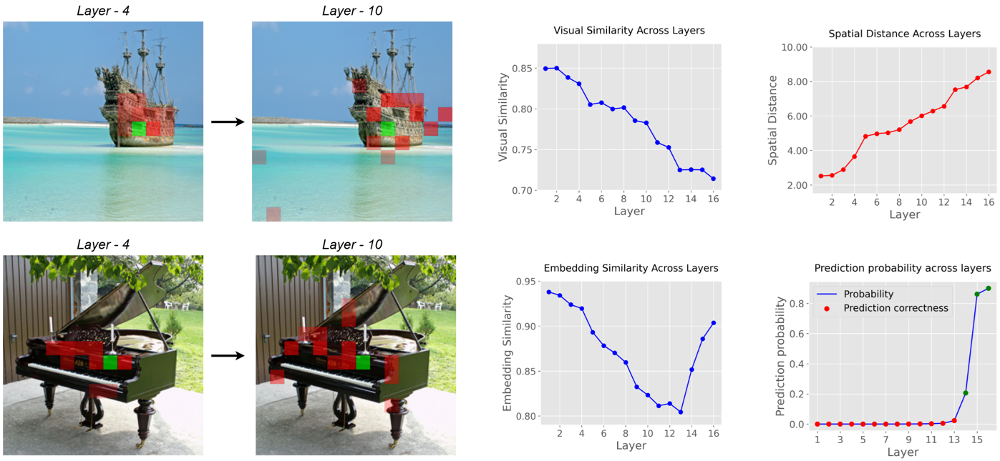

# Explaining Vision GNNs: A Semantic and Visual Analysis



This repository provides the official implementation for the paper:
**"Explaining Vision GNNs: A Semantic and Visual Analysis of Graph-based Image Classification"**
by Nikolaos Chaidos, Angeliki Dimitriou, Nikolaos Spanos, Athanasios Voulodimos, and Giorgos Stamou. Presented at xAI World Conference 2025.


[[`Paper`](https://arxiv.org/abs/2504.19682)]


This project enables the analysis of Vision Graph Neural Networks (GNNs) by extracting and visualizing key metrics that offer insights into their decision-making processes across different layers. It supports processing individual images and can optionally leverage GroundingDINO and Segment Anything (SAM) for object-centric modularity analysis.

## Features

* Calculates layer-wise metrics for Vision GNNs:
    * Visual Similarity ($S_{vis}$)
    * Spatial Distance ($D$)
    * Embedding Similarity ($S_{emb}$)
    * Layer-wise Classification Probability ($p$) (if ground truth label is provided)
    * Object-based Graph Modularity ($Q$) (if ground truth and segmentation tools are configured)
* Processes individual images.
* Integrates GroundingDINO and Segment Anything (SAM) for object mask generation.
* Outputs results in a structured JSON format.

## Setup and Installation

Follow these steps to set up the environment and download necessary models. It's recommended to use a virtual environment (e.g., conda or venv). Our experiments were conducted on Python 3.11 with CUDA 12.4 on a single NVIDIA L40S.

**1. Clone the Repository:**
```bash
git clone https://github.com/nickhaidos/Vision-GNNs-Explainer.git
cd Vision-GNNs-Explainer
```

**2. Install Python Dependencies:**
A `requirements.txt` file is provided.
```bash
pip install -r requirements.txt
```
Make sure `git` is already installed on your system.

**3. Download Pre-trained Model Weights:**
Create a `weights` directory and download the required model checkpoints.
```bash
mkdir weights
cd weights

# GroundingDINO Swin-T OGC model
wget -q https://github.com/IDEA-Research/GroundingDINO/releases/download/v0.1.0-alpha/groundingdino_swint_ogc.pth

# SAM ViT-H checkpoint
wget -q https://dl.fbaipublicfiles.com/segment_anything/sam_vit_h_4b8939.pth

# ViG-Small model checkpoint (example from Efficient-AI-Backbones)
wget -q https://github.com/huawei-noah/Efficient-AI-Backbones/releases/download/vig/vig_s_80.6.pth

cd ..
```
You will also need the GroundingDINO configuration file. You can typically find this in the [GroundingDINO repository](https://github.com/IDEA-Research/GroundingDINO) (`groundingdino/config/GroundingDINO_SwinT_OGC.py`). Place it in a known location or alongside its weights.

## Usage

The main script for running the analysis is `main.py`.

**Command-Line Arguments:**

The script accepts various arguments to configure the analysis:

* `--im_path`: (Required) Path to the input image file.
* `--model_weights`: (Required) Path to the pre-trained ViG model weights (e.g., `./weights/vig_s_80.6.pth`).
* `--model_variant`: Name of the ViG model variant function in `vig_2.py` (default: `vig_s_224_gelu`).
* `--out_dir`: Directory to save the analysis outputs (default: `./outputs`).
* `--device`: Device to use (`cuda`, `cpu`, or `auto`; default: `auto`).
* `--gt_label_idx`: (Optional) Ground truth ImageNet class index (0-999) for probability calculation.
* `--gt_label_name`: (Optional) Ground truth object name (e.g., "dog") for DINO prompt for modularity.
* `--cls_to_labels_path`: (Optional) Path to `imagenet1000_clsidx_to_labels.txt` file (default: `imagenet1000_clsidx_to_labels.txt`).
* `--dino_config`: (Optional) Path to GroundingDINO config file (e.g., `./path/to/your/GroundingDINO_SwinT_OGC.py`).
* `--dino_weights`: (Optional) Path to GroundingDINO weights file (e.g., `./weights/groundingdino_swint_ogc.pth`).
* `--sam_checkpoint`: (Optional) Path to SAM checkpoint file (e.g., `./weights/sam_vit_h_4b8939.pth`).
* `--sam_model_type`: SAM model type (`vit_h`, `vit_l`, `vit_b`; default: `vit_h`).

**Example:**
```bash
python main.py \\
    --im_path ./path/to/your/image.jpg \\
    --model_weights ./weights/vig_s_80.6.pth \\
    --model_variant vig_s_224_gelu \\
    --gt_label_idx 207 \\
    --gt_label_name "golden retriever" \\
    --cls_to_labels_path ./imagenet1000_clsidx_to_labels.txt \\
    --dino_config ./path/to/your/GroundingDINO_SwinT_OGC.py \\
    --dino_weights ./weights/groundingdino_swint_ogc.pth \\
    --sam_checkpoint ./weights/sam_vit_h_4b8939.pth \\
    --out_dir ./analysis_results
```

## Output

The script saves the calculated metrics for each image as a JSON file in the specified output directory (e.g., `analysis_results/metrics_<image_name>.json`). The JSON file has the following structure:

```python
{
    "visual_similarity": [0.732, 0.698, ..., 0.096],
    "spatial_distance": [3.575, 3.091, ..., 9.036],
    "embedding_similarity": [0.944, 0.941, ..., 0.923],
    "layer_probabilities_gt": [3.8e-05, 4.7e-05, ..., 0.623],    # or null if gt_label_idx not provided
    "layer_is_correct_gt": [False, False, ..., True],            # or null if gt_label_idx not provided
    "modularity": [0.353, 0.362, ..., 0.132],                    # or null if mask generation failed/skipped
    "predicted_class_idx_final": 207,                            # Imagenet class ID
    "predicted_class_name_final": "golden retriever"             # or null if mapping not available
}
```
Each list under metric keys contains floating-point values, corresponding to each layer of the ViG model analyzed.

## Heatmap Visualization

We also provide functions to visualize the graph connections throughout different layers of the model. Examples are included in `heatmap_visualization.ipynb` notebook

## Acknowledgements and Citations

This work builds upon several research projects. We encourage you to cite their original papers if you use components from their work:

* **Vision GNN (ViG):**
    * Han, K., Wang, Y., Guo, J., Tang, Y., & Wu, E. (2022). *Vision GNN: An Image is Worth Graph of Nodes.* arXiv preprint arXiv:2206.00272.
    * Github: [https://github.com/huawei-noah/Efficient-AI-Backbones](https://github.com/huawei-noah/Efficient-AI-Backbones)

* **GroundingDINO:**
    * Liu, S., Zeng, Z., Ren, T., Li, F., Zhang, H., Yang, J., ... & Su, H. (2023). *Grounding DINO: Marrying DINO with Grounded Pre-Training for Open-Set Object Detection.* arXiv preprint arXiv:2303.05499.
    * GitHub: [https://github.com/IDEA-Research/GroundingDINO](https://github.com/IDEA-Research/GroundingDINO)

* **Segment Anything (SAM):**
    * Kirillov, A., Mintun, E., Ravi, N., Mao, H., Rolland, C., Gustafson, L., ... & Girshick, R. (2023). *Segment Anything.* arXiv preprint arXiv:2304.02643.
    * GitHub: [https://github.com/facebookresearch/segment-anything](https://github.com/facebookresearch/segment-anything)


## Citing Our Work

If you find this repository and our paper useful in your research, please consider citing:

```bibtex
@inproceedings{chaidos2024explainingvgnn,
  title={Explaining Vision GNNs: A Semantic and Visual Analysis of Graph-based Image Classification},
  author={Chaidos, Nikolaos and Dimitriou, Angeliki and Spanos, Nikolaos and Voulodimos, Athanasios and Stamou, Giorgos},
  booktitle={xAI World Conference},
  year={2025},
}
```

## License

This repository contains code licensed under different terms, for details see `LICENSE` file.

## Contact

For questions or issues, please contact us at `nchaidos@ails.ece.ntua.gr` or open an issue in this repository.
